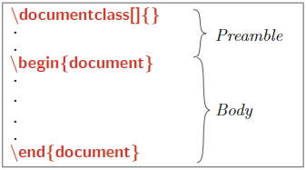
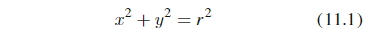
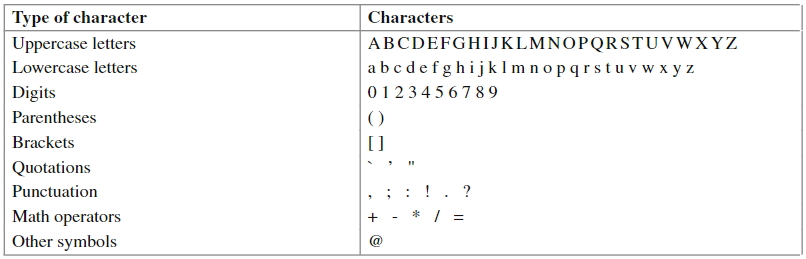
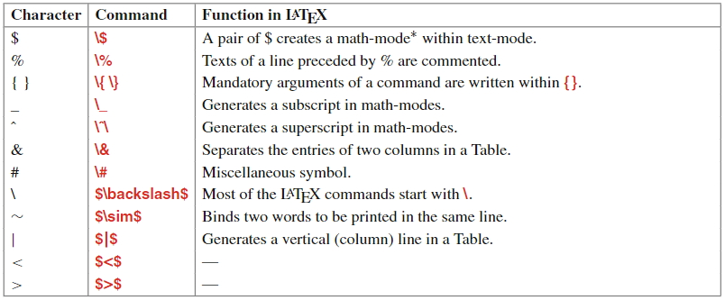
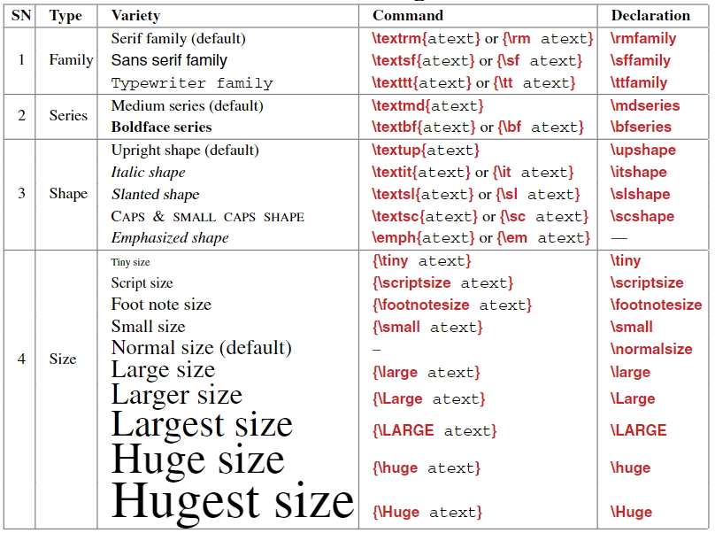
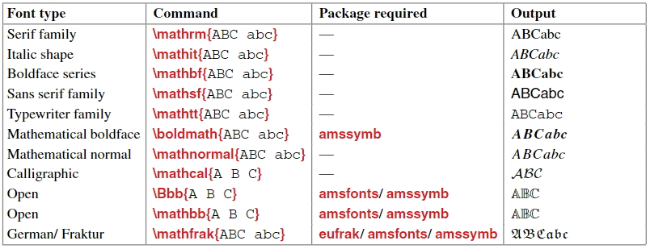
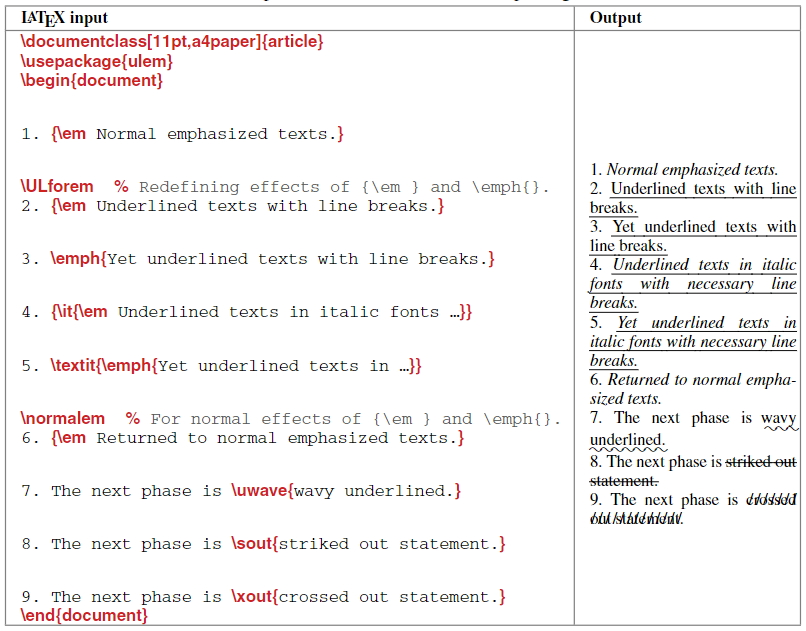
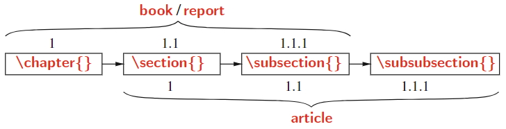
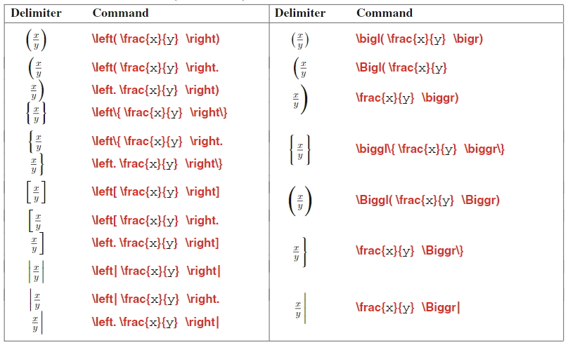

# 对latex的认识

## 一种排版语言, 需要: 

- 编译器编译出文件用以展示(比如pdf)
- 编辑器来编写源码(语法提示/补全/高亮/检查, 快捷的符号插入, 搜索查找...)

## 有模块系统, 用于添加功能(排版, 字体样式...)

- 包的仓库

- 包管理器

##  语法参考

latex的语法有很多版本, 详见[latex project](https://www.latex-project.org/), 目前为[latex2e](https://www.latex-project.org/help/documentation/usrguide.pdf)

# 叫不出名的符号输入

[detexify]( http://detexify.kirelabs.org/classify.html )手写识别符号, 非常高效方便

# 参考实践

## 编辑器

- [texmaker](https://www.xm1math.net/texmaker/doc.html)
  *一款编辑器, 有中文界面, 比较美观. 各种符号插入很方便. 编译功能使用命令行, 可完全自定义. 所以编译功能需要另行安装编译工具*
- vscode
  有插件, 爽的一批, 早知道就不去专门找别的编辑器了

## 编译器

- [miktex](https://miktex.org/)
  *一系列的解决方案, 多平台, 编译器集合, 包管理...*
  可以通过**MiKTeX Console** GUI界面配置, 其中"Packages"界面陈列了所用的包, 会发送网络请求, 加载有延迟, 列表很长, 容易卡顿
  通过命令`mpm --list-repositories`可列出所有自带的包仓库(mpm: MiKTeX Package Manager), 列表很长, 一堆的仓库. 所以默认的包安装来源为"a random package repository on the Internet"
  遇到没有安装的包会自动提示你安装, 非常省心

## 包平台

- [ctan]( https://ctan.org/ )
  一个各种tex包的集合平台

# 文档结构



`\documentclass[opt1, opt2,...]{doctype}`的`[]`内为`option`, `{}`内为`document class`

`option`用来传各种选项, 用于全局设置, 比如页面尺寸`a4paper`, 字体大小`11pt`, ...

`document class`为文档类型, 有4种标准的文档类型: letter, article, report, book.还有一些其他的 amsart, thesis, slide, slide, seminar,...


`preamble`里可以作一些定义, 引入一些包什么的, `body`编写文档内容

# 命令(Commands)

以反斜线`\`开头的一些功能性标注, 比如`\LaTeX`会显示latex的logo; `textcolor{blue}{this is blue colored}`接收了两个参数: 颜色, 内容, 将一段内容表示成蓝色; 上文提到的`\documentclass[opt1, opt2,...]{doctype}`也是, 可以接收一些选项和参数

空格使用`\`加`空格`表示

参数一般写在`{}`内, 当只有一个参数时也可以简单地用空格连接, 比如`\it italic`会将`italic`表示成斜体

# 环境(Environments)

在`\begin`和`\end`传入的一对相同的参数, 称为环境

比如

```latex
\begin{equation}
xˆ2+yˆ2=rˆ2
\end{equation}
```

`equation`是用于写公式的环境, 在该环境下公式会居中对齐, 并在尾部会加上标号



# 包(Packages)

相当于各种第三方的库, 扩充了功能

在`preamble`里引入包, 使用`\usepackage{name0, name1}`来引入各种包

`\usepackage`作为一个命令可以接收选项, 在`[]`内

# 在文档中可以直接显示的字符



latex中区分引号的开闭, 左引号为" ` ", 右引号为" ' "

除这些字符外, 其他的字符需要使用`\`转义来显示

有些字符在包(比如包amssymb, 一个包含很多常用符号的包)中, 其命令由`$`包裹,  比如` $\backslash$`显示`\`



# latex的模式

paragraph-mode, LR-mode, math-mode 

## paragraph-mode

处理通常的文本, 自动拆分单词, 行, 页以使文本适合区域大小

## LR-mode

从左至右处理文本, 没有单词拆分, 换行, 会超出页宽

## math-mode

前两种统称为 text-mode

math mode用来书写公式

需要引入包` amsmath `

## text-mode 下的字体

默认:  medium series serif family in upright shape and 10pt size. 

当然, 可以设置` \documentclass[ ]{} `以更改



`\/`可以增加单词内字母间隙, 比如 `of\/f\/ice `会避免`ffi`连在一起

## math-mode 下的字体



# 字体强调



`%`后的内容作为注释, 不被显示

有的命令会作用其后的所有内容, 比如`\ULforem`之后的文本会有下划线, 通过`\normalem`还原

# 字体颜色

字体的颜色使用这种模式来实现:

先定义一个颜色, 然后再使用

` \definecolor{cname}{rgb}{w,x,y} `

w, x, y在0-1之间

使用在文本上

`\textcolor{cname}{atext}`

# 公式编写

math-mode, 需要引入包"amsmath"

## 公式符号插入

行内: `$公式符号$`, 块: `$$公式$$`

# 源码中文输入

使用包`\usepackage[UTF8]{ctex}`, 原本源码输入只接受ascii那几个字符

可能会误以为要使用`\usepackage[utf8]{inputenc}`, 这其实是用来输入一些特殊字符的

# 自动化工具

arara: 用于执行一系列的命令, 通过在源文件内添加一些注释

## 格式化

 latexindent: 缩进工具

# 命令执行错误

查看是否缺乏环境perl, 安装perl环境

miktex装包的位置`C:\Program Files\MiKTeX 2.9\scripts`

全局的命令在` C:\Program Files\MiKTeX 2.9\miktex\bin\x64\ `, 指向装包的位置[参考](https://github.com/cmhughes/latexindent.pl/issues/110#issuecomment-393886583)

解决问题举例: 

在miktex默认安装的latexindent使用会报错, 模块路径依赖错误. 最终没解决问题, 反而是这么做的: 全局的命令在` C:\Program Files\MiKTeX 2.9\miktex\bin\x64\ `下, 默认这里有一个`latexindent.exe`调用 `C:\Program Files\MiKTeX 2.9\miktex\bin\x64\`的`latexindent.pl`. 而ctan下下来的包提供了`exe`文件, 于是就直接把`LatexIndent文件夹`, `latexindent.exe`, `defaultSettings.yaml`copy到全局命令路径下了(必须包含这三项, 在包里的readme有说明), 使用成功.

# 节



## 层次关系

| 层级   | 命令                   |
| ---- | ------------------------------- |
| -1   | `\part{part}`                   |
| 0    | `\chapter{chapter}`             |
| 1    | `\section{section}`             |
| 2    | `\subsection{subsection}`       |
| 3    | `\subsubsection{subsubsection}` |
| 4    | `\paragraph{paragraph}`         |
| 5    | `\subparagraph{subparagraph}`   |

这些都是带有标号的, 无序的节添加"\*", 比如`\section*{}`

# math mode常用分隔符



# 自定义命令

在`preamble`里可以使用指令`\newcommand{新命令的名称}{被替换的命令组合}`来创建一些命令的组合

比如` \newcommand{\bs}{$\backslash$} `创建了命令`\bs`来绘制一个反斜线, 作为`$\backslash$`的替代

## 接受参数

` \newcommand{名称}[参数个数, 最多9]{使用参数: ..{#1}..{#2}..{#n}..} `

比如

定义: ` \newcommand{\lmt}[4]{\lim_{#3\to  #4}\frac{#1}{#2}} `

使用: ` \lmt{xˆ2+3x-10}{x-2}{x}{2} `

输出: $\lim_{x\to2}\frac{xˆ2+3x-10}{x-2}$

## 几种定义命令的命令区别

`\newcommand` defines a new command, and makes an error if it is already defined.

`\renewcommand` redefines a predefined command, and makes an error if it is not yet defined.

`\providecommand` defines a new command if it isn't already defined.

[参考](https://tex.stackexchange.com/a/36178/209156)

## 参数可选

命令的第一个参数可设为可选, 形式如下

` \newcommand{名字}[参数数量][第一个参数的默认值]{使用参数: ..{#1}..{#2}..{#n}..}`

比如

定义: `\newcommand{\xv}[1][x]{\textbf{$#1$}} `

使用: `\xy, \xy[y]`

输出: $\textbf{x}, \textbf{y}$

# ctex相关

## \ctexset

在使用`\ctexset`命令定义一些标题样式时, 会有类似报错

`LaTeX3: The key 'ctex/section' is unknown and is being ignored.`

这个问题隐蔽在ctex的手册中(第3页), " 宏包ctex.sty提供全部功能，但**默认不开启章节标题设置功能**，需要使用heading选项来开启 "

`\usepackage[UTF8,heading = true]{ctex}`

# 页眉页脚设置

使用包`fancyhdr`

## 奇偶页设置

需要`\documentclass[a4paper, twoside]{article}`加上`twoside`

`twoside`模式的页面奇偶页面margin不同, 需要自定义页边距

# 页边距设置

使用包`geometry`来设置, 正如该包所描述

>  To  set  dimensions  for  page  layout  in  LATEX  is  not  straightforward.  

手动调整很不方便, 最好用一些包来完成

