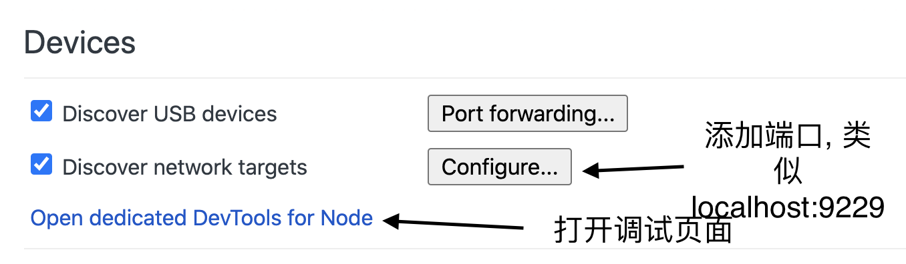

# XHR

- 在获取文件上传进度时, 可能会写成

  ```js
  xhr.onprogress = function(e) {
  	//something here
  }
  ```

  但这段代码在上传途中都不会执行, 因为这是response的progress. 应该写成

  ```js
  xhr.upload.onprogress = function(e) {
  	//something here
  }
  ```

# CSS

- 在flex盒内实现"文本溢出..."效果时, `white-space: nowrap`会撑大container, 因为依据标准container需要比其内部元素大.
  解决方式: 需要设置文本溢出效果的元素尺寸因为默认`width: 100%`, 尺寸由上级container确定, 依次向上查找明确设置了大小的container, 添加: `min-width: 0`, 再在需要设置文本溢出效果的元素上添加

  ```css
  {
      overflow: hidden;
      text-overflow: ellipsis;
      white-space: nowrap;
  }
  ```
  
  [参考](https://codepen.io/mxxxxxs/pen/NWPOVVb)
  
  在上述情况下, table元素宽度会溢出, 设置table元素
  
  ```css
  table {
      word-break: break-word;
  }
  ```
  
  

# React

- 在使用function组件时, 事件handler最好使用`useCallback`hook包裹, 而不是直接写在组件内. 后者每次更新组件都会重新声明并赋值, 影响渲染效率.

# 设置代理(万物开头)

很多时候命令行下载各种依赖会因为国情导致卡死, 可以设置bash代理来解决, 前提是需要准备好代理

```bash
export http_proxy=http://127.0.0.1:8001
export https_proxy=http://127.0.0.1:8001
```

# APT

## 代理(万物开头)

debian的包管理工具apt不使用变量http_proxy和https_proxy, 需要配置文件`/etc/apt/apt.conf`, 写入

```
Acquire::http::Proxy "http://代理:端口";
Acquire::https::Proxy "https://代理:端口
```

## 装包时, 搜索不到

`sudo apt update`更新列表

# 快捷键显示前缀

"^"是"ctrl", "M"是"alt"

# ssh

安装`sudo apt install openssh-client`客户端

配置文件位置 `~/.ssh/config` and `/etc/ssh/ssh_config`

添加

```
# Read more about SSH config files: https://linux.die.net/man/5/ssh_config
Host alice
    HostName 185.53.130.107
    Port 22
    User root
    PasswordAuthentication yes
```

## 代理(万物开头)

[参考]( https://terrywang.net/2011/09/23/ssh-via-http-proxy.html )

装包` connect-proxy `, 再在ssh的配置文件里加上一行`ProxyCommand connect -H 127.0.0.1:8001 %h %p`

## 防断连

[参考]( https://askubuntu.com/questions/127369/how-to-prevent-write-failed-broken-pipe-on-ssh-connection )

配置添加

```
ServerAliveInterval 30
ServerAliveCountMax 5
TCPKeepAlive yes
```

## 更改私钥密码

通常私钥会因为安全考虑会设置密码, 不过大多数时候都是给自己创造麻烦, 总有一天你可能会厌烦一次次输入密码.

密码是可以改的, 也可以留空, 就是没有密码了

`ssh-keygen -p`交互式更改密码

1. 输入私钥位置
2. 输入旧密码
3. 输入新密码(直接回车, 就是不设密码)
4. 确认新密码(直接回车, 就是不设密码)

[参考](https://stackoverflow.com/a/50703802)

# 编辑器

轻量级改动, vi或vim不熟可以用nano, 简单方便.

# 小技巧

快速回家`cd`, 回到前一次的目录`cd -`

快速命令查阅 https://tldr.ostera.io/ , 项目[tldr]( https://github.com/tldr-pages/tldr )推荐, 通过npm安装

# 添加到path

`export PATH="路径:$PATH"`

# Node

## 读取文件流的编码问题

`fs.createReadStream`不设置`encoding`则在监听`data`事件时获得的"chunk"是`Buffer`类型的, 否则为`string`. 

若要将文件流"pipe"到"response"流, http1.1传输使用[`Transfer-Encoding: chunked`编码](https://tools.ietf.org/html/rfc2616#section-3.6.1),`fs.createReadStream`**不能设置`encoding`**, 否则传输的是经过解码的string

*借助工具"HxD", 设置`binary`, 即认为文件是二进制的数据, 解码为AnsiChar/char8_t的字符构成的string*

前端直接拼接chunk会格式错误. 除非前端再编码, 这是莫名其妙绕远路.

前端使用fetch api处理, 获得res, 可以使用`res.blob()`直接获得拼接好的blob, 也可以`res.body.getReader()`来一块块处理"chunk", 更细粒度.

# 多语言排序

`string.localeCompare`用于本地语言比较, `array.sort`用于排序, 找一个语言检测工具比如`franc`用于判断语言

# ffmpeg裁剪视频

`ffmpeg -ss 00:00:00 -i input.mp4 -to 00:01:00 -c copy output.mp4`

# nvm安装

按照[描述](https://github.com/nvm-sh/nvm#install--update-script)使用

`curl -o- https://raw.githubusercontent.com/nvm-sh/nvm/v0.35.3/install.sh | bash`

报错

`curl: (7) Failed to connect to raw.githubusercontent.com port 443: Connection refused`

网上看的可能原因是 dns 污染, 通过[配置 host 来解决](https://github.com/hawtim/blog/issues/10), 并推荐了一个 [host 切换工具](https://github.com/oldj/SwitchHosts)

# 路径别名

有的项目会用`~`或`@`来代替某路径比如工作目录下的`src`作为路径前缀, 避免了输入大量的`../../..`, 也在移动文件时更方便, 路径解耦(虽然 vscode 在你移动文件后会询问是否更新路径)

(针对 vscode) 编写时会因此无法进行路径跳转, 需要对应编辑器插件辅助, 已知的途径:

1. 使用"别名路径跳转", 但只是能点击跳转

2. 参考 [vscode 文档](https://code.visualstudio.com/docs/languages/jsconfig#_using-the-include-property), 项目根目录添加一个 jsconfig.json, 填入类似:

   ```json
   {
     "compilerOptions": {
       "module": "esnext",
       "baseUrl": ".",
       "paths": {
         "~/*": ["./src/*"]
       }
     },
     "exclude": ["node_modules"]
   }
   ```

   这里使用`~`作为项目根目录前缀

   重启编辑器后 IntelliSense 生效, 可以自由跳转

打包编译需要配置 webpack, 或者 babel 有个[插件](https://github.com/entwicklerstube/babel-plugin-root-import)来实现这个功能(使用`~`开头)

# 调试手机端 web

这里只试过安卓

手机打开开发者模式, 运行 usb 调试

chrome打开[chrome://inspect/#devices](chrome://inspect/#devices), 应该可以看到设备然后选一个页面"inspect"即可

## 微信内 webview

```
debugx5.qq.com

debugmm.qq.com/?forcex5=true

debugmm.qq.com/?forcex5=false
```

勾选 【是否打开 TBS 内核 Inspector 调试功能】

# chrome 调试 node

`chrome://inspect/`打开



命令行调试模式启动 node

`node --inspect-brk main.js`

其中选项`--inspect-brk`在文件首行打断点, 触发 Chrome 显示调试界面

# node使用vscode调试打断点打不上

以前默认没什么问题的, 现在需要开启一个["auto attach"](https://code.visualstudio.com/docs/nodejs/nodejs-debugging#_attaching-to-nodejs), 不知为啥

# 命令行

```bash
command1 ; command2  # runs sequentially
command1 && command2 # runs sequentially, runs command2 only if command1 succeeds
command1 || command2 # runs sequentially, runs command2 only if command1 fails
command1 & command2  # runs simultaneously
```

# Unicode

js 里处理一些符号时, 在计算`length`时会比较魔法, 可以使用`string.normalize`来处理. 这里有一篇相关的[介绍](https://mathiasbynens.be/notes/javascript-unicode)

# cookie

2020.2.4 chrome有个更新(80), 有关cookie的`SameSite`属性, 这里有[相关信息](https://web.dev/samesite-cookies-explained/), 如果没设置或不合法, 浏览器默认其为`SameSite=Lax`, 在跨域请求时不会被带上.

Because a cookie's `SameSite` attribute was not set or is invalid, it defaults to `SameSite=Lax`, which prevents the cookie from being sent in a cross-site request. This behavior protects user data from accidentally leaking to third parties and cross-site request forgery.

在 localhost 开发时会导致登录失败问题, 可以去[chrome://flags/#same-site-by-default-cookies](chrome://flags/#same-site-by-default-cookies)关闭

mdn 的["Set-Cookie"](https://developer.mozilla.org/en-US/docs/Web/HTTP/Headers/Set-Cookie)页面可以细看一下

# lodash

## noop

就一个啥都不做的函数, 很迷惑

一个应用场景是作为函数的一个参数的默认值, 比如

```js
function run(fn = noop) {
  fn()
}
```

如果入参 fn 被省略, 又没有默认值就会报错

## identity

就返回其传入的第一个参数的一个函数, 也好像没啥用, 很迷

一个应用场景是要转换数据

```js
function run(transformJSON = identity) {
  const finalJSON = transformJSON(json, options)
}
```

如果入参 transformJSON 被省略, 就默认不转换 json 数据了

# 一些简写

a11y: Accessibility

i18n: internationalization

LGTM: Looks Good To Me(代码觉得可以 merge 了)

WIP: Work In Progress, do not merge yet(开发中, 不要误点"merge"按钮)

RFC: Request For Comments(用来拟定一个规范, 要求别人来讨论)

# 一些调试技巧

## 执行

调到下一个断点

逐步, 逐函数(不进入函数内部)

跳出该函数

中断结束, 重新启动

## 断点

普通断点, 鼠标点哪儿停哪儿

条件断点, 简单表达式控制是否命中(会导致程序执行缓慢)

代码添加调试关键字, 在代码里使用"debugger"会在该位置暂停, 效果同添加断点(程序会一直在那暂停, 可以添加"忽略断点"来跳过)

## 运行时值查看

鼠标悬停查看

看侧栏 scope 里的值

将值添加到监视面板, 方便查看

添加 logpoint (值输出点), 会直接打印值到 console 里

## 代码运行路径(从哪里来)

翻调用栈

# js 操作符

## 三幻神

&&

||

[??](https://developer.mozilla.org/en-US/docs/Web/JavaScript/Reference/Operators/Nullish_Coalescing_Operator)

## 三目运算符

xx ? yy : zz

## 省事儿神符

[?.](https://developer.mozilla.org/en-US/docs/Web/JavaScript/Reference/Operators/Optional_chaining)

# 深层对象的解构赋值注意事项

很常见的问题是深层对象中的某个 key 不存在, 导致这个 key 对应的 value 下的解构都无法完成, 导致报错

这个就很不爽, js 的设计总给人不完善的感觉, 需要新特性, 就像之前提到的 optional chaining "?." 来解决这类痛点

为了解决这个问题, 可以给每个 key 附上初始值, 例如

```
const { main: { content: { title = 'defaultTitle' } = {} } = {} } = obj || {}
```

