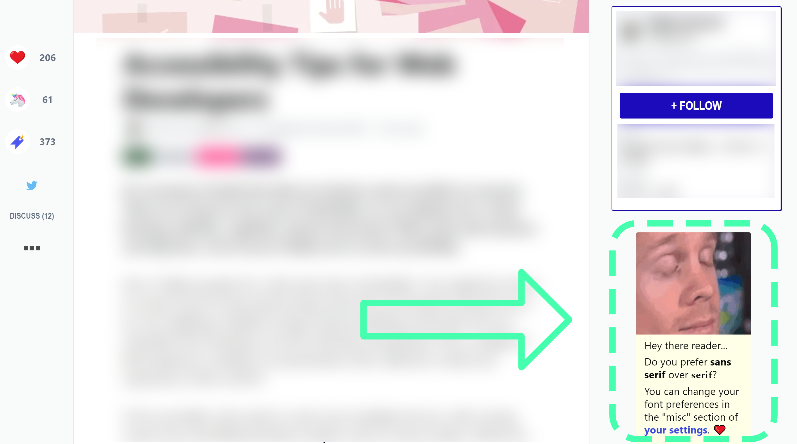

# [bilibili]( https://www.bilibili.com/ )

首页的"slide"一共有5张, 自动切换

一般第1, 4, 5张是内容, 第2, 3张是广告

为什么这么设计?

- 为了兼顾内容和广告, 即b站自身和第三方的利益. 内容用来吸引潜在用户, 广告用来盈利, 二者相辅相成.
- 第一张silid会在页面刚打开不久就切换掉, 所以曝光概率最高的不是第一张, 而是第二张
- 第三张以后不设置广告的原因是, 用户一般在页面加载完后就会向下滚动网页, 导致靠后的slide没有机会被看到

# [dev.io]( https://dev.to/ )

吸引用户注册的一个有意思的trick

问用户"你喜欢有衬线的字体还是无衬线的字体", 用户情不自禁地就去点了, 满脑子都是"有衬线无衬线", 根本不会第一时间反应到是让人注册, 点开就是...

